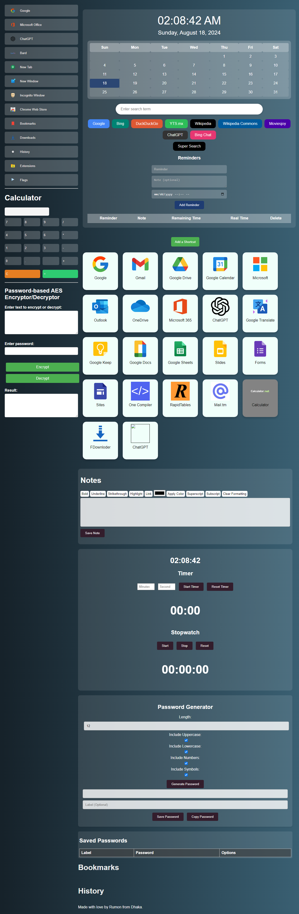

# Rumon's New Tab Extension

## Overview

Welcome to Rumon's New Tab Extension! This project is designed to enhance your new tab page with powerful tools and customization options. The extension includes various features such as a calculator, bookmarks section, history section, reminders, and much more.

## Features

- **Calculator**: Perform quick calculations directly from your new tab page.
- **Bookmarks Section**: Access and manage your favorite websites easily.
- **History Section**: View and navigate your recent browsing history.
- **Reminder**: Set and manage reminders to keep track of important tasks and events.
- **Countdown Timer**: Set and track countdowns for important events.
- **Text Encryption & Decryption**: Securely encrypt and decrypt text for private information.
- **Note-Taking Functionality**: Take quick notes and save important information.
- **Password Generator**: Generate strong and secure passwords for your online accounts.
- **Stopwatch**: Keep track of time with a built-in stopwatch.
- **Supersearch**: Enhanced search functionality to quickly find information.
- **New Website Pinning**: Pin and organize your most frequently visited websites for easy access.

## Screenshots

Below are some screenshots of the extension in action:

## Installation

Since this extension is not available in the Chrome Web Store, you can install it manually by following these steps:

1. Download the extension ZIP file from [GitHub Releases](https://github.com/yourusername/your-repo/releases/download/v1.0/romans-new-tab.zip).
2. Extract the ZIP file to a location on your computer.
3. Open Google Chrome and go to `chrome://extensions/`.
4. Enable "Developer mode" by toggling the switch at the top right corner.
5. Click on "Load unpacked" and select the extracted folder of the extension.
6. The extension should now be installed and visible in your Chrome toolbar.

If you encounter any issues, please feel free to [contact me](mailto:your-email@example.com) for assistance.

## Download

Enhance your browser experience by downloading and installing the extension now:

[Download Now](https://github.com/yourusername/your-repo/releases/download/v1.0/romans-new-tab.zip)

## About the Developer

Created by **Rumon**, a passionate developer with expertise in creating innovative browser extensions. Rumon is dedicated to enhancing user experience with powerful tools and features. For inquiries, please contact [asrumon@duck.com](mailto:asrumon@duck.com).

## License

This project is licensed under the MIT License - see the [LICENSE](LICENSE) file for details.

